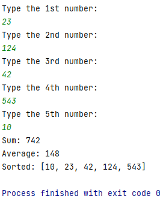

# arraySorterAndStats
Allows the user to input 5 numbers and calculates the stats of the resulting set. Then sorts and displays the numbers. Also contains a method I wrote to convert integers to ordinal numbers.

